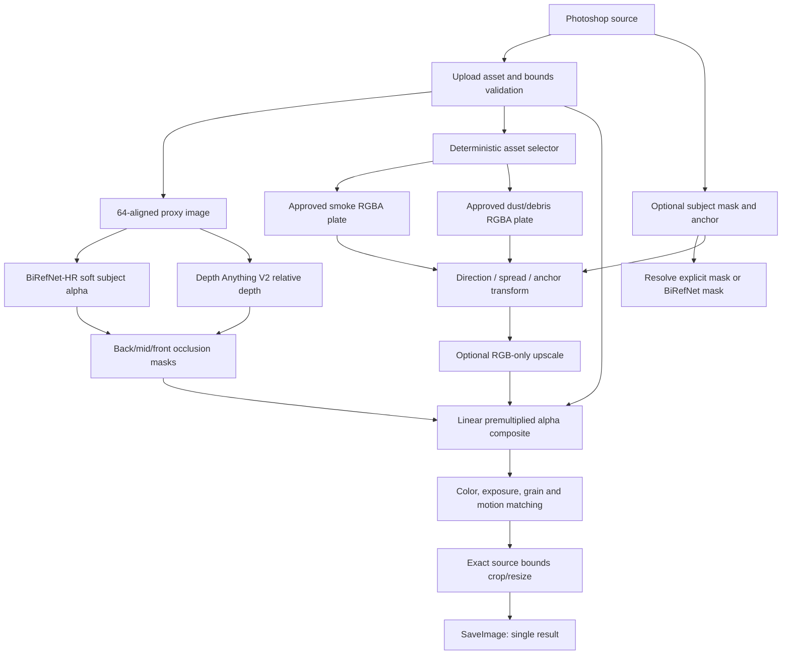

# 黑色烟尘：已验证可行的稳定生产方案

> 文档状态：生产主路径设计 / 单一事实来源  
> 适用环境：ComfyUI Desktop、RTX 5080 16GB、PixelOasis 网关、Photoshop UXP 插件  
> 更新日期：2026-07-24  
> 目标：只返回一张与输入 `source.bounds` 完全相同宽高的黑烟、沙尘、碎石成品图。  
> 重要范围：本文只把网络上存在公开案例、官方节点或官方文档支撑的路径标为稳定；生成式烟雾板和语义精修仅列为实验分支，不得作为默认 readiness 依赖。

## 1. 结论先行

### 1.1 当前方案是否成熟

结论分层如下：

| 路径                                       | 成熟度          |     能否作为默认按钮链路 | 依据                                                                                   |
| ------------------------------------------ | --------------- | -----------------------: | -------------------------------------------------------------------------------------- |
| 自有/已授权预抠 RGBA VFX 素材 + alpha 合成 | **成熟**        |                 **可以** | Video Copilot 等公开产品长期使用预抠烟雾、尘土、碎石；Blender 可自行生成并拥有输出作品 |
| BiRefNet-HR 主体分割 + SAM2 点选修正       | **成熟组件**    |                 **可以** | 官方仓库/模型卡和 ComfyUI 社区节点均有公开实现                                         |
| Depth Anything V2 做粗深度遮挡             | **成熟组件**    |   **可以，作为遮挡辅助** | 官方模型和推理代码公开；不能代替主体 mask                                              |
| ComfyUI 官方 alpha/Porter-Duff 合成        | **成熟**        |                 **可以** | ComfyUI 官方 compositing 节点提供 alpha split/join 和 Porter-Duff                      |
| Blender Mantaflow 离线生成烟雾素材         | **成熟**        | **可以作为素材制作工具** | Blender 官方 Gas/Smoke 文档和输出许可明确                                              |
| LayerDiffuse SDXL 生成透明前景             | **可验证 beta** |       **不作为默认依赖** | 官方 ComfyUI 示例存在，但只支持 SD1.5/SDXL，不是烟尘专用模型                           |
| Z-Image Turbo 在线生成烟尘板               | **实验**        |               **不可以** | 官方 ControlNet 只证明深度/姿态/边缘/修复控制；没有公开稳定的影视烟尘 alpha 案例       |
| Qwen Image Edit 局部融合                   | **实验**        |                 **关闭** | 没有公开黑烟生产案例，不能保证人物和 ROI 外像素不变                                    |

因此，当前文档若把“Z-Image 双板在线生成”写成默认生产路径，会夸大成熟度。**稳定版本必须改为“素材库优先，生成式路径可选”。**

### 1.2 推荐生产路径

```text
Photoshop source / subject mask / anchor
→ 网关上传与尺寸校验
→ 加载已验收的 RGBA smoke/debris 素材对
→ 代理图上运行 BiRefNet-HR 主体 alpha
→ Depth Anything V2 Large/Small 生成相对深度
→ 根据方向、锚点、spread 对素材做确定性变换
→ 主体前后景遮挡 + premultiplied alpha 合成
→ 可选 RGB 效果层超分（不超分 alpha）
→ 原图尺寸精确回填
→ 唯一 result artifact
```

在线扩散模型不参与默认按钮执行。它们只用于离线生成候选素材或开发 profile，候选必须人工验收后才能加入素材清单。

## 2. 网络验证到的公开案例

### 2.1 行业预抠素材案例

[Video Copilot Action Essentials 2](https://www.videocopilot.net/products/action2/) 的公开产品页明确列出：

- 500 个预抠 alpha 的 action/VFX 元素。
- 包含 smoke、fire、dust、debris 等类别。
- 提供 2K 版本，主视频为 RGB + Alpha。
- 产品定位就是在 After Effects、Premiere 等软件中直接叠加合成。

这不是本项目的可分发资产（商业素材不能直接打包），但它验证了本方案最关键的生产假设：**影视级烟尘通常以已验收的 RGBA/预抠元素作为合成源，而不是每次从文本随机生成一张烟。**

### 2.2 Blender 离线素材制作案例

[Blender Gas/Smoke 官方手册](https://docs.blender.org/manual/en/latest/physics/fluid/type/domain/gas/index.html) 提供 Gas、Smoke、Fire、Noise、缓存和体积渲染设置。Blender 官方[许可证页](https://www.blender.org/about/license/)明确说明：Blender 软件为 GPL，但使用 Blender 创作的图像、影片和 `.blend` 数据属于创作者，可自行使用和发布。

因此开源项目可以：

1. 用 Blender Mantaflow 离线烘焙黑烟、沙尘、碎石和碎片运动。
2. 输出带 alpha 的 PNG 序列/静帧，或保留 EXR 作为母版。
3. 为每个素材记录方向、密度、seed、色彩空间和 SHA-256。
4. 只把经过人工验收的渲染结果放入项目资产包。

### 2.3 ComfyUI 透明层案例

[ComfyUI-layerdiffuse 官方仓库](https://github.com/huchenlei/ComfyUI-layerdiffuse) 提供可导入的 `layer_diffusion_fg_example_rgba.json`，实际节点包括：

```text
CheckpointLoaderSimple(SDXL)
→ LayeredDiffusionApply
→ KSampler
→ LayeredDiffusionDecodeRGBA
```

该仓库 README 明确说明目前支持 SD1.5/SDXL，并要求 RGBA 解码尺寸为 64 的倍数。它证明透明扩散层是可实现的，但没有证明“Z-Image Turbo 生成影视黑烟”已经成熟，所以本文只把它列为离线素材制作 beta。

### 2.4 ComfyUI alpha 合成案例

ComfyUI 官方代码的 compositing 扩展提供：

- `SplitImageWithAlpha`。
- `JoinImageWithAlpha`。
- `PorterDuffImageComposite`，包括 `SRC_OVER`、`SCREEN`、`MULTIPLY` 等模式。
- alpha 会先转换为 premultiplied 形式再进行 Porter-Duff 运算。

这为本项目的运行时合成提供了可直接复用的公开实现基础；不需要再从白底烟图反推 alpha。

## 3. 生产模型与依赖锁定

### 3.1 默认运行时依赖

| 职责       | 模型/组件                           | 许可                     | 默认状态                    | 备注                                  |
| ---------- | ----------------------------------- | ------------------------ | --------------------------- | ------------------------------------- |
| 主体 alpha | `ZhengPeng7/BiRefNet_HR`            | MIT                      | 必需                        | 输出软 alpha；支持复杂头发和主体轮廓  |
| 深度       | `Depth-Anything-V2-Large`           | CC-BY-NC-4.0             | 非商用质量 profile 必需     | 当前项目非商用可用；不得标 Apache-2.0 |
| 深度替代   | `Depth-Anything-V2-Small`           | Apache-2.0               | permissive/degraded profile | 质量较低但许可证更宽松                |
| 合成       | ComfyUI 官方 compositing + 项目节点 | GPL 项目代码             | 必需                        | 项目新增节点应遵循仓库许可证策略      |
| 素材制作   | Blender Mantaflow                   | GPL 软件；渲染输出归作者 | 离线工具                    | 不在按钮运行时加载 Blender            |

### 3.2 可选依赖

| 组件                           | 用途                   | 为什么不进默认 readiness                                                       |
| ------------------------------ | ---------------------- | ------------------------------------------------------------------------------ |
| `RealESRGAN_x4plus`            | RGB 效果层细节恢复     | 它是 RGB restoration，不应直接当 alpha 超分器；素材库优先做成 4K/8K 后可不加载 |
| `SAM2`                         | 用户点/框修正主体      | 交互式 mask 修正，不应取代默认 BiRefNet                                        |
| LayerDiffuse SDXL              | 离线生成透明候选       | 只支持 SD1.5/SDXL，依赖版本和权重较多                                          |
| Z-Image Turbo + ControlNet 2.1 | 离线候选或实验 profile | 官方示例是 Depth/Canny/Pose/Inpaint 等控制，不是烟雾 alpha 生产案例            |
| Qwen-Image-Edit-2511           | 局部语义融合实验       | 没有本项目场景案例，也没有经过 16GB 保护性回归                                 |

### 3.3 不再使用

- 不使用绿幕作为默认烟雾背景；扩散模型不能保证纯绿和无渐变，已有测试出现绿色矩形。
- 不使用单张白底 Z-Image 板通过固定 `white_threshold` 反推透明度。
- 不使用程序化 FBM 烟体作为影视级默认效果。
- 不把 `4x-UltraSharp` 作为硬依赖；来源和许可不够稳定，替换为官方 `RealESRGAN_x4plus`，且只处理 RGB。
- 不把 `Depth Anything` 的 `depth < 0.5` 直接当人物 mask。

## 4. 稳定工作流图



### 4.1 素材库目录

```text
models/pixeloasis/vfx/black-smoke-dust/
  manifest.json
  smoke/
    up-right/heavy/*.png
    up-left/heavy/*.png
    right/medium/*.png
    left/medium/*.png
    up/heavy/*.png
  debris/
    up-right/heavy/*.png
    up-left/heavy/*.png
    right/medium/*.png
    left/medium/*.png
  previews/
```

推荐运行时资产为预抠 straight/unassociated RGBA PNG（兼容 ComfyUI `IMAGE` + alpha mask）。EXR 只做离线母版；若引入 EXR，必须提供独立 loader、色彩空间测试和 Windows Desktop 兼容测试。历史素材若是 premultiplied，加载节点必须先安全 unpremultiply，不能在合成时再次乘 alpha。

每个 manifest 条目必须包含：

```json
{
  "id": "smoke_up_right_heavy_001",
  "kind": "smoke",
  "direction": "upRight",
  "density": "heavy",
  "width": 4096,
  "height": 4096,
  "premultiplied": false,
  "colorSpace": "sRGB",
  "approved": true,
  "source": "blender-mantaflow-local",
  "license": "project-owned-render",
  "sha256": "..."
}
```

第一版至少准备 `6 个方向 × 3 个密度 × 3 个 seed` 的 smoke/debris 配对。缺少匹配项时允许旋转、缩放和镜像，但必须记录变换，禁止随机拉伸。

## 5. 具体合成算法

### 5.1 输入分析

代理图按比例缩放，并统一到 64 对齐：

```text
scale = min(1, 2048 / max(sourceWidth, sourceHeight))
proxyWidth  = roundToMultiple(sourceWidth  * scale, 64)
proxyHeight = roundToMultiple(sourceHeight * scale, 64)
```

交付尺寸永远来自 `source.bounds`，不能来自代理图、素材图或 ComfyUI history。

### 5.2 主体 alpha

优先级：

```text
Photoshop subjectMask
→ BiRefNet-HR
→ SAM2 点/框修正
→ Depth foreground 粗 mask（仅 degraded）
```

要求：

- 保留软 alpha，禁止一开始二值化。
- 头发/透明衣料使用 3–8 px feather，像素半径按原图比例换算。
- mask 覆盖率 `<0.5%` 或 `>95%` 进入可疑状态。
- 未提供主体 mask 且自动 mask 低置信时，只允许生成后景烟，不能把烟直接盖到人物前面。

### 5.3 深度遮挡

Depth Anything V2 只提供相对深度，不是主体分割。建议构造：

```text
back = effectAlpha * (1 - subjectAlpha) * farWeight
mid = effectAlpha * (1 - subjectAlpha * nearWeight)
front = effectAlpha * subjectAlpha * frontConfidence * 0.15..0.35
```

黑烟主体先合成到人物后方，再将少量可信烟丝/粒子合成到前景。这样即使深度边界有误，也不会把人物整块抹掉。

### 5.4 资产变换

`direction` 只控制流向和旋转；`spread` 控制素材缩放和覆盖区域；`anchorX/anchorY` 控制效果源点；`density` 控制 alpha、层数和颜色对比；`particleAmount` 选择 debris 等级和前景大颗粒比例。

所有素材变换使用 `torch.grid_sample` 或等价向量化操作：

- straight RGB 和 alpha 使用相同几何网格分别变换。
- 变换完成前保持 straight alpha，进入 Porter-Duff 合成前只执行一次 premultiply。
- 不使用每像素 Python 循环。
- 生成变换后的 metrics：覆盖率、alpha P50/P95、边缘透明度和最大连通域。

### 5.5 合成

使用 ComfyUI 官方 Porter-Duff 语义或等价实现：

```text
effectPremult = straightEffectRGB * effectAlpha
backResult = over(source, smokeBack)
subjectResult = over(subjectOriginal, backResult)
result = over(subjectResult, smokeFront + debrisFront)
```

不要把 straight alpha 当成 premultiplied alpha；否则会产生黑边、白边和人物轮廓 halo。亮沙尘可以单独使用 screen/add，但必须仍受 debris alpha 限制。

### 5.6 超分

最稳妥方式是把素材库直接制作成 4096 或 8192。若必须从 2048 代理效果层放大：

- 只对 RGB 使用 `RealESRGAN_x4plus`。
- alpha 使用双线性/双三次 + guided edge refinement，不能直接送入 RGB 超分网络。
- 超分后重新 premultiply，最后在原图尺寸合成。
- 不对 source 原图整体超分，不改变人物脸部和服装。

## 6. ComfyUI 节点和文件布局

### 6.1 项目自定义节点

```text
ComfyUI/custom_nodes/pixeloasis_effects/
  __init__.py
  depth_nodes.py             # PO_DepthEstimate
  subject_nodes.py           # PO_BiRefNetSubjectMask / PO_SubjectMaskResolve
  asset_nodes.py             # PO_VFXAssetSelect / manifest 校验
  transform_nodes.py         # PO_EffectLayout / RGBA 变换
  composite_nodes.py         # PO_DepthAwareComposite / PO_ExactSizeResult
  quality_nodes.py           # PO_VFXQualityGate
  smoke_nodes.py             # 仅 fallback，不进默认 workflow
  requirements.txt
  README.md
```

### 6.2 目标 API workflow

```text
LoadImage #10
├─ PO_BiRefNetSubjectMask #11
├─ PO_DepthEstimate #12
└─ PO_EffectLayout #13
   └─ PO_VFXAssetSelect #20/#21
      ├─ PO_RGBATransform smoke
      └─ PO_RGBATransform debris
           └─ PO_DepthAwareComposite #40
                └─ PO_ExactSizeResult #80
                     └─ SaveImage #90
```

`#90` 是唯一输出节点；中间 smoke、debris、depth、mask 只供 debug，不进入 artifact 列表。若使用 ComfyUI 官方节点，应在 API Format 导出后再提交网关，禁止手写与当前 `/object_info` 不一致的 class type。

## 7. 前后端契约

### 7.1 用户参数

| 参数             |                                范围 |      默认 | 作用                     |
| ---------------- | ----------------------------------: | --------: | ------------------------ |
| `density`        |                             0.4–2.0 |      1.35 | 素材级别、alpha 和对比度 |
| `direction`      | `upRight/upLeft/right/left/up/auto` | `upRight` | 方向、旋转和拖尾         |
| `spread`         |                            0.65–1.5 |      1.05 | 覆盖范围和素材缩放       |
| `particleAmount` |                             0.4–1.0 |      0.72 | 沙尘、碎石和大颗粒等级   |
| `anchorX`        |                                 0–1 |      0.58 | 归一化锚点 X             |
| `anchorY`        |                                 0–1 |      0.62 | 归一化锚点 Y             |
| `seed`           |                              uint32 |      随机 | 素材选择和变换复现       |

插件不得暴露模型文件名、sampler、CFG、matte threshold 或显存设置。

### 7.2 请求

```json
{
  "schemaVersion": "2.0",
  "capabilityId": "effects.blackSmokeDust",
  "correlationId": "ps-...",
  "idempotencyKey": "ps-...",
  "source": {
    "assetId": "ast_source",
    "scope": "document",
    "document": {
      "id": "document-id",
      "width": 7008,
      "height": 4672,
      "colorMode": "RGB",
      "bitDepth": 8
    },
    "bounds": { "left": 0, "top": 0, "width": 7008, "height": 4672 }
  },
  "inputs": {
    "editMaskAssetId": null,
    "subjectMaskAssetId": null,
    "referenceAssetIds": [],
    "points": [{ "x": 4065, "y": 2897 }]
  },
  "parameters": {
    "density": 1.35,
    "direction": "upRight",
    "spread": 1.05,
    "particleAmount": 0.72,
    "anchorX": 0.58,
    "anchorY": 0.62,
    "seed": 328174119
  },
  "options": { "profile": "quality_16gb" }
}
```

### 7.3 输出

能力文件只声明一个 artifact：

```json
{
  "artifacts": [
    {
      "role": "result",
      "layerName": "黑色烟尘成品",
      "blendMode": "normal",
      "opacity": 100,
      "previewOnly": false
    }
  ]
}
```

Photoshop 只创建 `PixelOasis/黑色烟尘/黑色烟尘成品` 图层；不得恢复旧的 smoke/dust/compositePreview 三层回填契约。

## 8. 网关编排

### 8.1 Pipeline stages

```text
preflight
→ analyzeSource
→ resolveSubjectMask
→ resolveDepth
→ selectApprovedAssets
→ transformAssets
→ composite
→ qualityGate
→ exactSizeNormalize
→ registerSingleArtifact
```

默认 profile 不包含 ComfyUI diffusion sampler，因此显存峰值和耗时更可控。ComfyUI 仍作为节点执行器，但主 workflow 不加载 Z-Image、Qwen 或 LayerDiffuse。

### 8.2 失败策略

| 失败                           | 行为                                                          |
| ------------------------------ | ------------------------------------------------------------- |
| 素材 manifest 缺失/签名不符    | readiness `missing_assets`，拒绝建 job                        |
| BiRefNet 缺失                  | 若有 Photoshop subject mask 则继续；否则 degraded，只生成后景 |
| Depth Large 缺失               | 使用 Small；再失败则只允许显式 back placement                 |
| asset alpha 损坏/尺寸非法      | 切换同类 approved 资产；无候选则失败                          |
| 合成后尺寸错误                 | job 失败，不允许返回代理图                                    |
| Qwen/LayerDiffuse 实验分支失败 | 不影响默认 profile；仅返回可诊断 warning                      |

### 8.3 日志

单个网关运行只写一个 `pixeloasis-logs-YYYY-MM-DD-HH-mm-ss.log`，至少记录：

- 输入名称、MIME、字节数、宽高、bounds、assetId。
- manifest entry、素材 SHA、变换参数、seed、模型 revision。
- 每个 ComfyUI 节点开始/结束、耗时和错误。
- subject/depth 置信度、alpha metrics、质量门禁结果。
- result 文件名、大小、宽高、artifactId 和 Photoshop 下载结果。

## 9. 文件级开发步骤

### Phase 0：锁定素材和模型清单

新增/修改：

```text
services/model-gateway/models/models.manifest.yaml
services/model-gateway/models/vfx-assets.manifest.json
services/model-gateway/src/adapters/comfyui/readiness-probe.js
```

步骤：

1. 用 Blender 离线生成或取得明确授权的 RGBA smoke/debris 素材。
2. 生成每个素材的 SHA-256、尺寸、premultiplied、色彩空间和许可证元数据。
3. 把 Large 标记为 `CC-BY-NC-4.0`，Small 标记为 `Apache-2.0`。
4. readiness 只检查默认 profile 需要的 BiRefNet、Depth、manifest 和自定义节点。

验收：manifest 改一字节或素材 SHA 不匹配时 readiness 为非 ready；商业来源资产不能进入开源默认包。

### Phase 1：实现 ComfyUI 运行节点

新增/修改：

```text
ComfyUI/custom_nodes/pixeloasis_effects/subject_nodes.py
ComfyUI/custom_nodes/pixeloasis_effects/asset_nodes.py
ComfyUI/custom_nodes/pixeloasis_effects/transform_nodes.py
ComfyUI/custom_nodes/pixeloasis_effects/composite_nodes.py
ComfyUI/custom_nodes/pixeloasis_effects/quality_nodes.py
ComfyUI/custom_nodes/pixeloasis_effects/__init__.py
```

验收：

- 固定素材、参数和 seed 的输出 SHA 稳定。
- RGBA alpha 不出现黑边、白边和绿色污染。
- ComfyUI 官方 `SplitImageWithAlpha`/Porter-Duff 语义与项目节点结果一致。
- 单张输出宽高可匹配任意 source bounds。

### Phase 2：替换 API workflow

新增/修改：

```text
services/model-gateway/workflows/comfyui/effects/smoke-dust-quality.api.json
services/model-gateway/workflows/comfyui/effects/smoke-dust-quality.meta.json
```

步骤：

1. 从当前 ComfyUI Desktop 导出 API Format workflow。
2. 删除默认 Z-Image、ConditioningZeroOut、白底 matte 路径。
3. 接入素材选择、RGBA 变换、深度合成、精确尺寸和 SaveImage。
4. `outputs` 只保留 `nodeId=90, role=result`。
5. 用 `/object_info` 和 `/prompt` 逐节点验证。

验收：工作流不加载实验模型；ComfyUI history 只有一个最终输出；同一 seed 可复现。

### Phase 3：网关与 capability

修改：

```text
services/model-gateway/src/pipelines/definitions/effects.blackSmokeDust.js
services/model-gateway/src/pipelines/orchestrator.js
services/model-gateway/src/adapters/comfyui/binding-engine.js
services/model-gateway/src/adapters/comfyui/output-collector.js
services/model-gateway/src/jobs/worker.js
services/model-gateway/capabilities/effects/effects.blackSmokeDust.capability.json
```

验收：

- `POST /v2/jobs` 后状态为 `queued → preparing → running → postprocessing → succeeded`。
- 缺素材/模型/节点时返回明确 `424`，不创建伪成功 job。
- 只注册 `result` artifact，且 `finalWidth/finalHeight` 等于 bounds。
- 取消任务、超时和尺寸错误均有完整日志和错误码。

### Phase 4：Photoshop 回填

重点文件：

```text
pixeloasis-plugin/scripts/capabilities/parameter-form.js
pixeloasis-plugin/scripts/capabilities/preflight.js
pixeloasis-plugin/scripts/jobs/job-controller.js
pixeloasis-plugin/scripts/placement/artifact-placer.js
```

验收：

- 参数由 capability schema 渲染，插件不硬编码模型参数。
- 插件上传 source/subject mask，发送 anchor 和方向。
- 完成后只回填一个成品图层，原图像素不被覆盖。
- 无法 readiness 时按钮显示真实原因，而不是允许点击后静默失败。

## 10. 质量门禁

### 10.1 素材门禁

- RGBA 文件可解码，alpha 通道存在，尺寸至少 2048 长边。
- 四边透明度和 RGB bleed 均低于阈值；不得存在矩形底板。
- smoke alpha P95 在 `0.35–0.85`，中心有连续体积，边缘保留 `0.03–0.25` 半透明烟丝。
- debris 至少存在可辨识的大颗粒和方向性拖尾，不得只是均匀噪声。
- 方向、密度、色温和素材 manifest 描述一致。

### 10.2 成品门禁

- 唯一 artifact role 为 `result`。
- `result.width == source.bounds.width`。
- `result.height == source.bounds.height`。
- 效果区域外原图像素变化率低于 1%。
- 人物脸部、头发和服装不出现生成式重绘、硬黑边或白边。
- 后景烟和前景烟的遮挡顺序与 subject mask/depth 一致。
- 100% 查看时黑烟有核心、体积层和边缘烟丝；沙尘/碎石可辨识。

### 10.3 稳定性门禁

- RTX 5080 16GB 连续 30 次素材路径无 OOM、无永久 queued、无跨 job 串图。
- 单图运行目标 P95 小于 30 秒（不含首次模型加载）。
- 7008×4672、4096×4096、竖图、无人物和复杂头发各至少 10 张回归。
- 默认 profile 不需要网络访问，不下载模型，不依赖 Civitai 或商业资产站点。

## 11. 实验分支（不参与默认可用性）

### 11.1 LayerDiffuse

保留独立 workflow：

```text
services/model-gateway/workflows/comfyui/effects/smoke-dust-layerdiffuse-experimental.api.json
```

只有同时满足以下条件才能进入 beta：

- SDXL checkpoint、LayerDiffuse 权重和 ComfyUI custom node 版本锁定。
- 输出 alpha 通过素材门禁。
- 在 16GB GPU 连续 10 次不 OOM。
- 与离线 Blender 素材进行 A/B 视觉比较，不能仅因为有 alpha 就替代高质量素材。

### 11.2 Z-Image Turbo + ControlNet

官方 `Z-Image-Turbo-Fun-Controlnet-Union-2.1` 模型卡证明了 Depth/Canny/Pose/Inpaint 控制和 8-step/Lite 模型，但没有黑烟 alpha 生产案例。因此只允许：

- 离线批量生成素材候选。
- 需要新素材时的人工审核工具。
- 独立 `experimental` profile。

生成结果不能直接注册为 `result`；必须先进入 manifest 并通过人工/自动门禁。

### 11.3 Qwen Image Edit

只允许在确定性成品上对烟尘 ROI 做实验。必须使用 crop/stitch、ROI 外差异检测和人物保护；失败直接返回未精修成品。没有公开案例证明它可以稳定保持 Photoshop 人物身份，因此不能影响基础 readiness。

## 12. 测试资产和回归

新增：

```text
services/model-gateway/test/integration/black-smoke.test.mjs
services/model-gateway/test/fixtures/vfx-assets/manifest.json
services/model-gateway/test/fixtures/images/effects.blackSmokeDust/
services/model-gateway/tools/smoke-black-smoke.mjs
ComfyUI/custom_nodes/pixeloasis_effects/tests/test_asset_nodes.py
ComfyUI/custom_nodes/pixeloasis_effects/tests/test_composite_nodes.py
```

保留 `Test.JPG` 回归：原尺寸 `7008×4672`，固定参数和 seed，记录素材 ID、alpha metrics、depth、最终尺寸和唯一 artifact。历史失败的白底、绿幕和装饰卷纹图片继续作为质量门禁负样本。

## 13. 运行时同步

源码目录：

```text
E:/PixelOasis/ComfyUI/custom_nodes/pixeloasis_effects/
```

桌面端运行目录：

```text
F:/ComfyUI/ComfyUI/custom_nodes/pixeloasis_effects/
```

必须通过部署脚本同步并校验 SHA：

1. 停止 ComfyUI。
2. 原子同步节点包和 manifest。
3. 清理 `__pycache__`。
4. 重启 ComfyUI。
5. 用 `/object_info` 检查节点签名。
6. 用 `/prompt` 跑固定小图。
7. 最后刷新网关 readiness。

## 14. 参考来源

1. [Video Copilot Action Essentials 2](https://www.videocopilot.net/products/action2/)：预抠 alpha、2K smoke/dust/debris 素材及传统合成案例。
2. [Blender Gas/Smoke Manual](https://docs.blender.org/manual/en/latest/physics/fluid/type/domain/gas/index.html)：Gas、Smoke、Fire、Noise 和缓存设置。
3. [Blender License](https://www.blender.org/about/license/)：Blender 软件 GPL；使用 Blender 创作的图像、影片和数据归创作者。
4. [Blender Alpha Over Manual](https://docs.blender.org/manual/en/latest/compositing/types/color/alpha_over.html)：alpha-over、premultiplied/straight alpha 和透明效果合成。
5. [ComfyUI 官方仓库](https://github.com/Comfy-Org/ComfyUI)：官方节点和 compositing 实现。
6. [ComfyUI-layerdiffuse](https://github.com/huchenlei/ComfyUI-layerdiffuse)：可导入的 SDXL RGBA workflow，作为 beta 案例。
7. [BiRefNet 官方仓库](https://github.com/ZhengPeng7/BiRefNet) 与 [BiRefNet-HR 模型](https://huggingface.co/ZhengPeng7/BiRefNet_HR)：主体分割。
8. [Depth Anything V2 官方仓库](https://github.com/DepthAnything/Depth-Anything-V2) 与 [Large 模型卡](https://huggingface.co/depth-anything/Depth-Anything-V2-Large)：相对深度；Large 为 CC-BY-NC-4.0，Small 为 Apache-2.0。
9. [Real-ESRGAN 官方仓库](https://github.com/xinntao/Real-ESRGAN)：RGB restoration；本文不把它当 alpha 超分器。
10. [Z-Image Turbo ControlNet 2.1](https://huggingface.co/alibaba-pai/Z-Image-Turbo-Fun-Controlnet-Union-2.1)：Depth/Canny/Pose/Inpaint 控制案例；没有烟尘 alpha 生产案例。
11. [Qwen-Image-Edit-2511](https://huggingface.co/Qwen/Qwen-Image-Edit-2511)：通用图像编辑模型；本文只列实验分支。

## 15. 最终发布判定

只有以下条件全部成立，按钮才能显示 `ready` 并允许点击：

1. 默认素材 manifest 已下载、签名正确且全部通过素材门禁。
2. BiRefNet、Depth profile 和 ComfyUI 节点 readiness 通过。
3. `Test.JPG` 和回归集连续通过尺寸、alpha、遮挡、唯一 artifact 和稳定性门禁。
4. 默认执行路径不加载 Z-Image、LayerDiffuse、Qwen 或网络下载资源。
5. 任何实验分支都不会改变 `effects.blackSmokeDust` 的默认 readiness。

这套定义把“网络上已有公开案例支撑的生产路径”和“尚未被案例验证的研究路径”明确分开，避免把能运行的 demo 误称为影视级成品方案。
